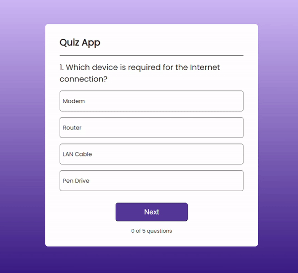

# Quiz App 🧠

A simple React quiz application with multiple-choice questions.

## Overview

The **Quiz App** is a React-based quiz application where users can answer multiple-choice questions. It provides instant feedback on correct and incorrect answers, along with a final score at the end of the quiz.



## Features 🌟
   - Interactive quiz interface.
   - Multiple-choice questions.
   - Score tracking.

## Usage

1. **Clone the repository:**

   ```bash
    git clone https://github.com/Eraycann/Quiz-App

    Open the project folder:    cd quiz-app
    Install dependencies:       npm install
    Run the application:        npm run dev (It is recommended to install vite for react)

The app will be accessible at http://localhost:3000.
Start answering questions and enjoy the quiz!


## Live Demo 🌐
   - Check out the live demo: [Quiz App Demo](#) <!-- Add your live demo link -->

## Data
   - The quiz questions are stored in the data.js file. You can customize the questions, options, and correct answers as needed.

## Contributing 🤝
   - Contributions are welcome! Feel free to enhance the design, add new features, or fix any issues. Open a pull request to contribute.

## License 📜
   - This project is licensed under the MIT License.


## Author ✨
- Eraycan Sivri
- Contact: eraycansivri@hotmail.com
- GitHub: [GitHub Profile](https://github.com/Eraycann)

- Happy quizzing! 🎉


